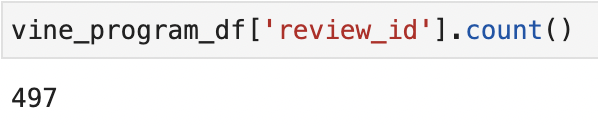
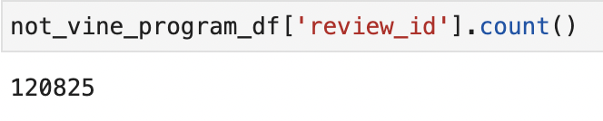
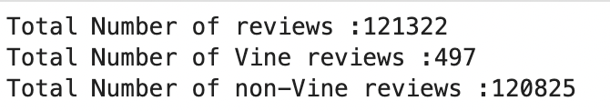
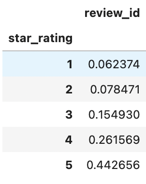
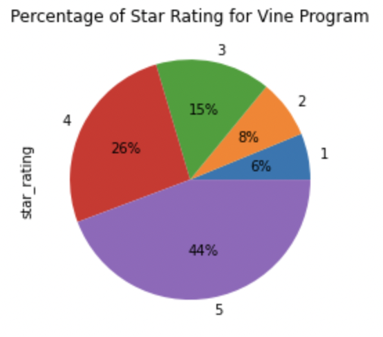
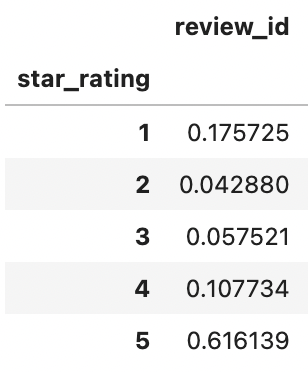
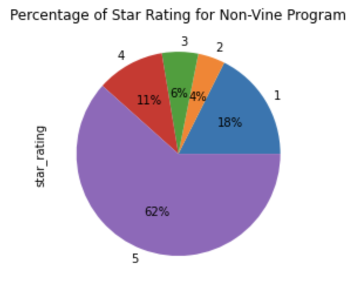

# Amazon_Vine_Analysis

# Purpose of this project:
To use PySpark, PostgresSQL, Pandas and AWS service to determine if the reviews for Health Personal Care category have any bias between vine (paid) program and non-vine program.

# Result
- How many Vine reviews and non-Vine reviews were there?

There are 497 reviews are from the Vine program.

There are 120,825 reviews are from the non-Vine program.

- How many Vine reviews were 5 stars? How many non-Vine reviews were 5 stars?

After we filtered with reviews that has equal or greater than 20 votes of helpful_votes and the helpful_votes has equal or greater than 50% of rates, we got the following results for the counts of reviews:
Total Review: 121,322
Total Vine Review: 497
Total non-Vine Review: 120,825

- What percentage of Vine reviews were 5 stars? What percentage of non-Vine reviews were 5 stars?

There are about 44% of five-stars review for the Vine program.

There are about 62% of five-stars review for the non-Vine program.
